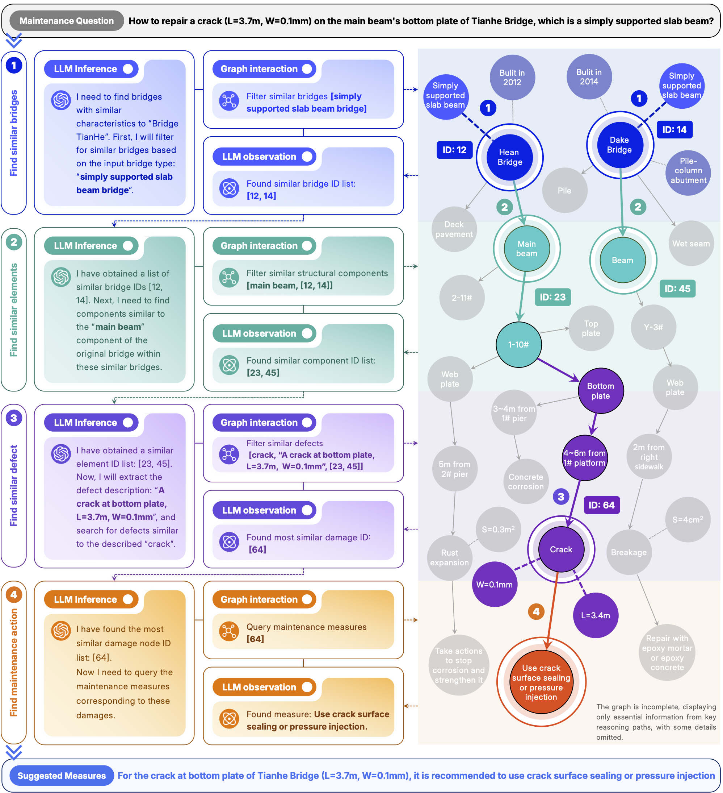

# BMKG-DCoT: Decision-making Chain of Thought on Bridge Maintenance Knowledge Graphs


**BMKG-DCoT** is a novel framework that empowers Large Language Models (LLMs) with Chain-of-Thought (CoT) reasoning to provide expert-level decision support for bridge maintenance.

By interacting with a **Bridge Maintenance Knowledge Graph (BMKG)**, our model mimics an expert's workflow to identify similar historical defects and recommend appropriate maintenance actions. This approach tackles the high retrieval costs and ambiguity found in traditional Case-Based Reasoning (CBR) methods.

---

## 🏛️ How It Works

The system operates on an iterative, autonomous loop that requires **no LLM fine-tuning**. This loop simulates an expert's cognitive process through three core phases:

1.  **🧠 Inference-Planning (Thought):**
    The agent uses a pre-defined prompt to instruct an LLM (e.g., GPT-4, Gemini) to analyze the problem. The LLM formulates a reasoning step, which is recorded in a "scratchpad."

2.  **🎬 Interaction-Decision (Action):**
    The agent parses the LLM's output to identify a specific action. It then executes this action using a suite of tools that interact with the knowledge graph, such as filtering nodes or querying relationships.

3.  **🔬 Observation-Judgment (Observation):**
    The results from the executed action are appended to the scratchpad. This new context allows the agent to refine its reasoning in the next iteration of the loop.

---

## ✨ Key Features

* **🤖 LLM-Powered Reasoning:** Leverages state-of-the-art LLMs (Gemini, GPT, and more) to drive a dynamic Chain-of-Thought process.
* **🕸️ Knowledge Graph Interaction:** Performs targeted and efficient information retrieval from a structured BMG.
* **🔍 Semantic Search:** Implements fast and accurate semantic similarity searches for bridge components and defects.
* **💡 Few-Shot Capability:** Adapts to different scenarios with just a few examples.
* **📜 High Explainability:** The entire reasoning process is transparent, showing a clear decision path from problem to solution.
---

---
## 📦 File Structure

```bash
BMKG-DCoT/
├── code/
│   ├── tools/
│   │   ├── graph_funcs_maintenance.py # Utility functions for direct graph traversal and data extraction.
│   │   └── retriever.py               # Implements the semantic retriever using vector embeddings (FAISS).
│   ├── GraphAgent.py                  # Core logic for the agent, including the beam search and interaction loop.
│   ├── graph_fewshots.py              # Provides few-shot examples to guide the LLM's reasoning.
│   ├── graph_prompts.py               # Defines the system and user prompt templates for the LLM.
│   └── run.py                         # Main script to configure and launch experiments.
└── data/
    ├── graph.json                     # The Bridge Maintenance Knowledge Graph.
    └── data.json                      # The dataset containing questions and ground truth answers.
```
---
## 🚀 Quick start

### Prerequisites

* Python 3.8+
* An API key for your chosen LLM service (e.g., OpenAI, Google AI, ZhipuAI).

### Installation

1.  **Clone the repository:**
    ```bash
    git clone <your-repository-url>
    cd Graph-CoT
    ```

2.  **Create a virtual environment and install dependencies:**
    ```bash
    python -m venv venv
    source venv/bin/activate  # On Windows, use `venv\Scripts\activate`
    pip install -r requirements.txt
    ```
     `requirements.txt` is:
    ```txt
    faiss==1.7.4
    jsonlines==4.0.0
    langchain_community==0.3.30
    networkx==3.1
    numpy==1.24.4
    openai==2.0.1
    pandas==2.0.3
    sentence_transformers==2.2.2
    torch==2.4.1
    tqdm==4.67.1
    zhipuai==1.0.7
    ```

3.  **Set up Data:**
    * Place your knowledge graph file as `data/graph.json`.
    * Place your evaluation dataset as `data/data.json`.

4.  **Configure API Keys:**
       * In the GraphAgent class’s `__init__` method inside code/GraphAgent.py, locate the section corresponding to the large model you want to use, and then insert your API key.
   For convenience, it’s recommended to set your key as an environment variable and read it in the code. But for quick startup, you can also directly enter the key in the code.
       * Open `code/GraphAgent.py` and insert your API key in the corresponding LLM configuration section. For example, for Google AI:
   Locate the configuration sections for large models such as `Ggemini`, `ChatGPT`, `glm`, and `qwen`, and replace the API key with the corresponding large model API key.

       ```python
       # Configuration for calling Gemini via an OpenAI-compatible endpoint.
       if self.llm_version in ['models/gemini-2.0-flash']:
           self.llm = ChatOpenAI(
               temperature=0,
               max_tokens=300,
               model_name=self.llm_version,
               openai_api_key="Your_Gemini_API_Key",  # <-- Modified here
               openai_api_base="https://generativelanguage.googleapis.com/v1beta",
               model_kwargs={"stop": "\n"},
           )
           self.enc = None
       ```


### Running the Agent

Use the `run.py` script to start an experiment. You can specify the LLM model, dataset, and other parameters via command-line arguments.

**Example Usage:**

```bash
python run.py \
  --dataset bridge \
  --path ./data \
  --save_file ./outputs \
  --embedder_name sentence-transformers/all-MiniLM-L6-v2 \
  --faiss_gpu False \
  --max_steps 10 \
  --llm_version glm-4-flash
```
### Key Command-Line Arguments

* `--llm_version`: The LLM to use (e.g., `gpt-5`, `glm-4-flash`, `gemini-2.0-flash`).
* `--dataset`: The name of the dataset configuration to use (defined in `graph_prompts.py`).
* `--path`: Path to the directory containing `graph.json` and `data.json`.
* `--save_file`: Path to save the output results in JSON Lines format.
* `--zero_shot`: Add this flag to run the agent without few-shot examples.
* `--max_steps`: Maximum number of reasoning steps the agent can take.

---
## 🗂 BMKG 

We release a de-identified BMKG dataset for research only.

#### `graph.json`
- Nodes: bridge name, component code/part, defect location, defect, maintenance measure, etc.
  - Typical fields: `id`, `type`, `name`, and optional attributes.
- Edges: relations such as `bridge -> component`, `component -> part`, `location -> defect`, `defect -> measure`.
  - Typical fields: `source`, `target`, `relation`.

#### `data.json`
- Includes at least: `qid`, `question`, and `answer` for evaluation or demonstration.

### Usage & Ethics
- For academic research only.
- Any re-identification attempts or commercial use are strictly prohibited.
- Please acknowledge this dataset ("de-identified BMKG") when publishing results.

---

## 🌐 A Note on Language Support

Please note that the current experimental data is derived from `Chinese inspection reports`. Consequently, the knowledge graph and the current codebase are primarily designed and tested for `Chinese`.

While we have included translated English prompts in the prompt files, they have not been fully tested yet. We plan to release a version fully adapted for English datasets in a future update. Stay tuned!
  
---
## ✉️ Citation & Contact

Please cite this paper the "Yuchen Wang, Yanjie Zhu, Wen Xiong, C.S. Cai. "BMKG-DCoT: Decision-making Chain of Thought on Bridge Maintenance Knowledge Graphs." in your publications.  
For collaborations and questions, please open an issue.


